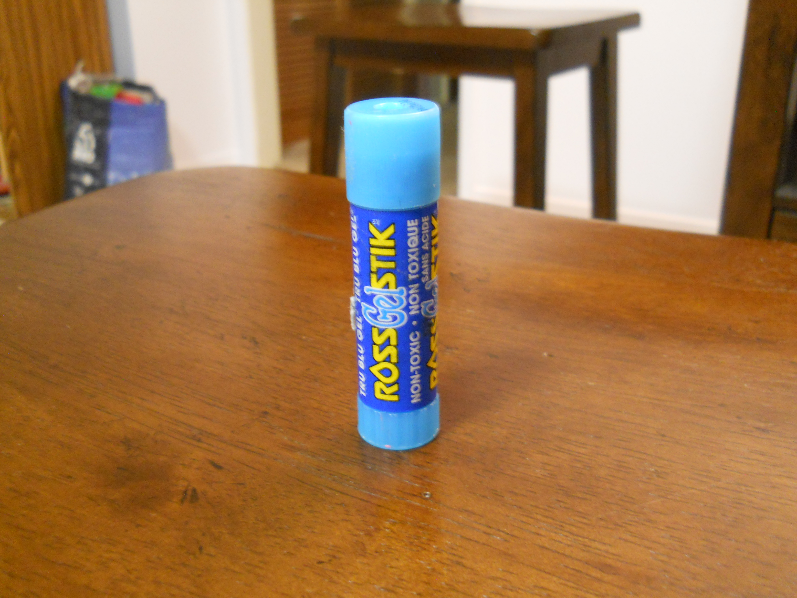
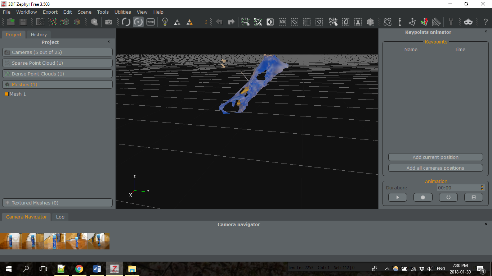

So when I got home last night, I tried again! This time I chose an even simpler object: a gluestick, and I moved to a room with slightly better lighting. However by the time I get home it's dark out, which makes things more difficult... 

Because it seems that the problem is indeed the pictures. It worked slightly better this time, but the program didn't seem to accept most of the pictures. A few turned out! But the result was a horrifying amalgamated blob. So, looks like I'm going to have to try something different. :/

